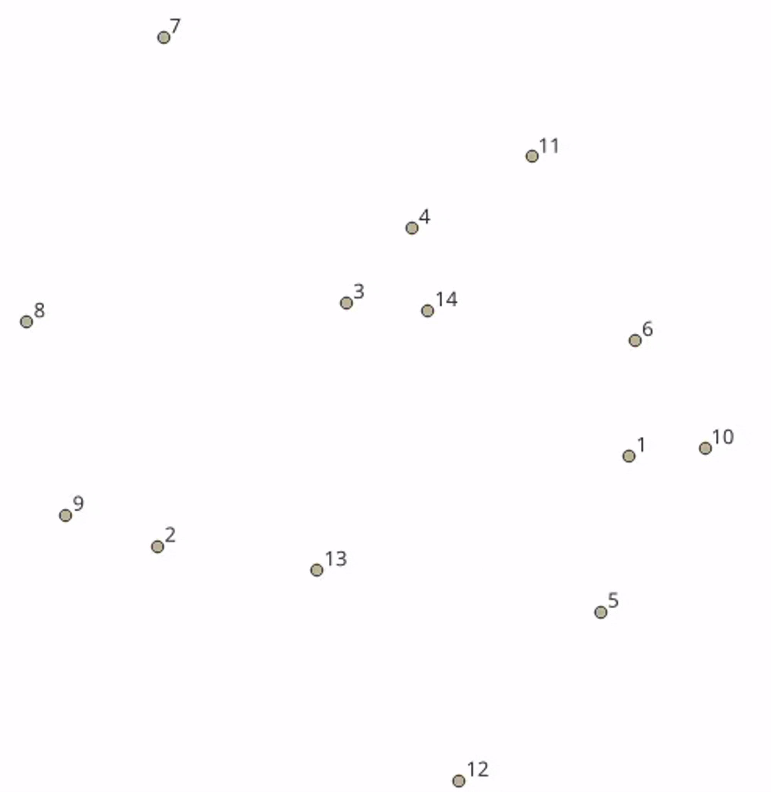

# optimizationftta

This repository contains our project for the **High Rate Networks** course.

## Optical Fiber Network Map

The following figure shows our **optical fiber network map**, where the routing is optimized using the **Traveling Salesman Problem (TSP) algorithm** to achieve an efficient fiber layout.

## Link Distances

The table below shows the fiber link distances between consecutive nodes, measured in meters, as used in the TSP-based optimization.
Only the source category (`cat`), target category (`tcat`), and distance (`dist`) are shown.

| cat | tcat | dist (m) |
|----:|-----:|---------:|
| 3  | 14 | 1183.093 |
| 2  | 13 | 1067.060 |
| 14 | 11 | 1534.768 |
| 11 | 4  |  888.475 |
| 1  | 10 |  559.327 |
| 12 | 5  | 1422.181 |
| 13 | 12 | 2203.682 |
| 6  | 3  | 1905.076 |
| 7  | 8  | 3112.522 |
| 9  | 2  |  659.702 |
| 10 | 6  |  732.377 |
| 8  | 9  | 2260.073 |
| 5  | 1  | 1236.146 |
| 4  | 7  | 1855.785 |

