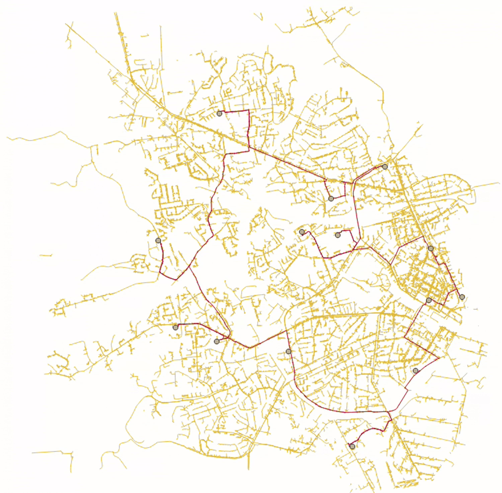

# optimizationftta

This repository contains our project for the **High Rate Networks** course.

## Optical Fiber Network Map

The following figure shows our **optical fiber network map**, where the routing is optimized using the **Traveling Salesman Problem (TSP) algorithm** to achieve an efficient fiber layout.

